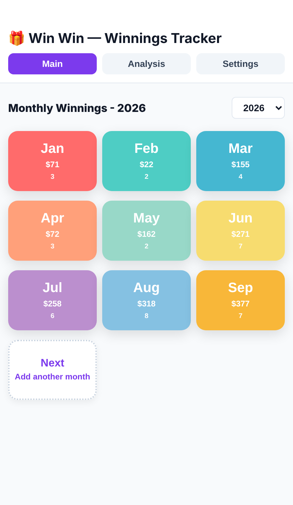
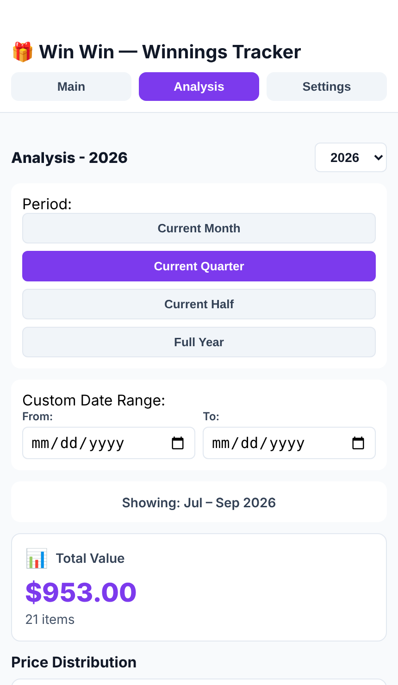
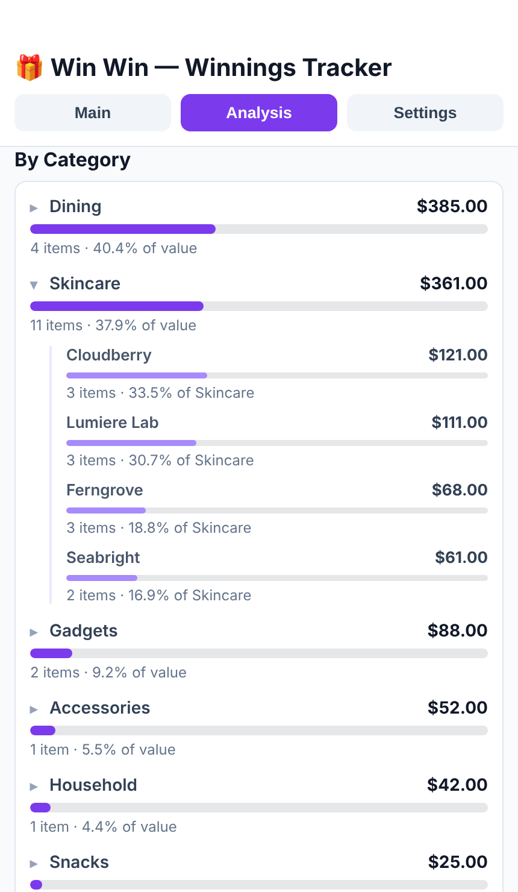
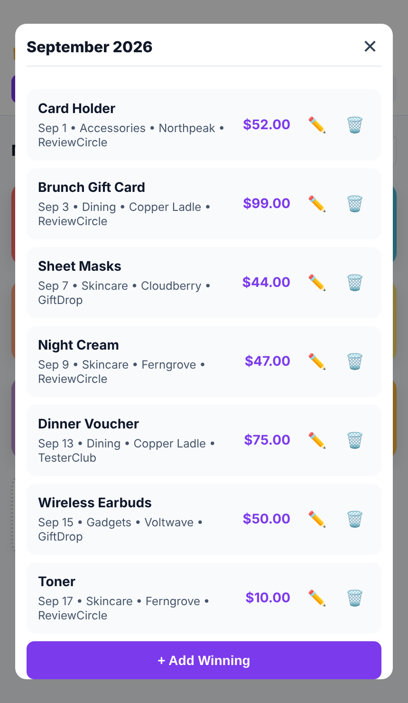
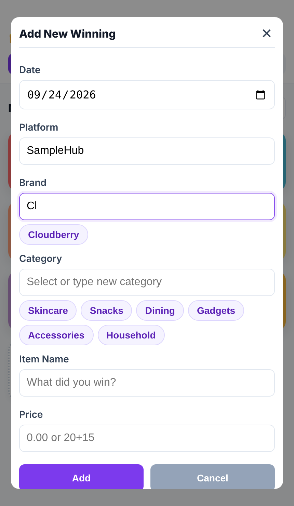
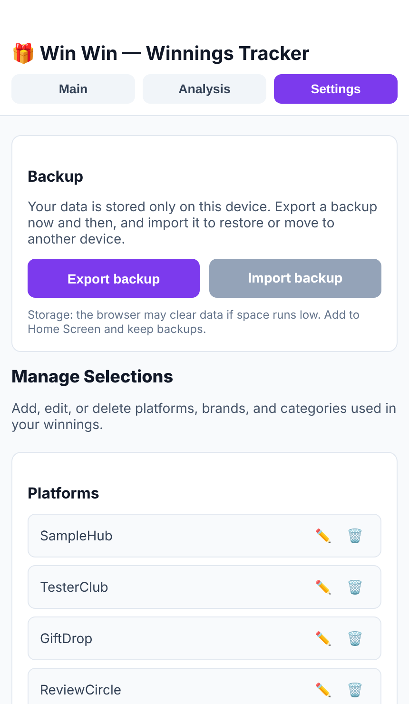

# 🎁 Win Win — Winnings Tracker

A mobile-first web app for keeping track of the things you win — product tests, giveaways, samples, vouchers — and seeing what they add up to, month by month.

**Live app:** https://zhushangs.github.io/win-win/
Open it on your phone and choose **Add to Home Screen** to use it like a native app (works offline).

<p align="center">
  
  
  
</p>

## Features

### Monthly overview
Each month with winnings gets a color card showing its total value and item count. Switch years from the dropdown, and tap **Next** to add a new entry.

### Month detail
Tap a month to see every item in it, sorted by date, with its category, brand and platform. Edit or delete items from here, or add another one to that month.

### Fast entry
- **Price expressions** — type `20+15` or `3*12.5` and the result is calculated for you; invalid input is flagged instead of saved.
- **Tap-to-fill suggestions** for platform, brand and category. The ones you use most are shown first; start typing to search the rest.
- New platforms, brands and categories are remembered automatically, and spelling variants like `cloudberry` / `Cloudberry` are merged into one.

### Analysis
- Pick a period — current month, quarter, half year, full year — or a custom date range, for any year.
- Total value and item count, plus a price distribution (below $50 / $50–$100 / above $100).
- **By Category**: each category's total and share of value. Tap a category to see which brands it came from.
- **By Platform**: each platform's total and share of value. Tap a platform to see which categories it gave you.

### Settings
- Add, rename or delete platforms, brands and categories. Renaming updates every existing record; renaming onto an existing name merges the two.
- **Export / import backups** as a JSON file to keep your data safe or move it to another device. Importing merges by record, so nothing is duplicated or deleted.

## Screenshots

| Monthly overview | Month detail | Add a winning |
| :---: | :---: | :---: |
|  |  |  |

| Analysis | By category | Settings & backup |
| :---: | :---: | :---: |
|  |  |  |

<sub>Screenshots use sample data.</sub>

## Your data

Everything is stored **only on your device**, in the browser's IndexedDB — there is no server and no account. The app asks the browser for persistent storage, but browsers can still clear site data, so export a backup from **Settings** now and then.

> **iPhone note:** the Home Screen app and Safari keep separate storage. Add the app to your Home Screen first and enter data there.

## Tech stack

- React 19 (Create React App)
- IndexedDB for storage, with a localStorage fallback and automatic migration from older versions
- A hand-written service worker for offline use (Progressive Web App)
- [expr-eval](https://github.com/silentmatt/expr-eval) for price expressions
- GitHub Actions → GitHub Pages for deployment

## Development

```bash
cd winnings-tracker
npm install
npm start          # http://localhost:3000
```

To start with sample data while developing, set `isDev: true` in `winnings-tracker/src/lib/settings.js`. Set it back to `false` before committing — production starts empty.

The service worker only registers in production builds, so `npm start` never serves stale cached files.

### Deployment

Every push to `main` that touches `winnings-tracker/` runs `.github/workflows/deploy.yml`, which builds the app and publishes it to GitHub Pages. You can also run it manually from the **Actions** tab.

## Project structure

```
winnings-tracker/
├── public/
│   ├── manifest.json         # PWA manifest (name, icons, theme color)
│   └── sw.js                 # Service worker (offline support)
└── src/
    ├── components/
    │   ├── WinningTracker.js # Main UI: tabs, forms, analysis, settings
    │   └── WinningTracker.css
    └── lib/
        ├── storage.js        # IndexedDB storage + migration + persistence request
        ├── mockData.js       # Sample data used when isDev is true
        └── settings.js       # isDev flag
```
